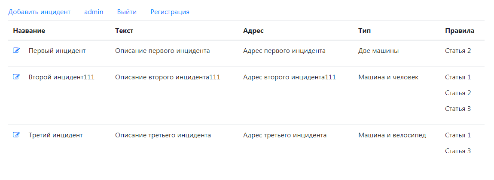
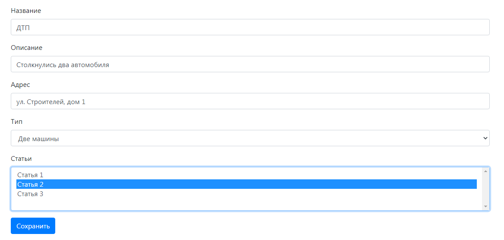
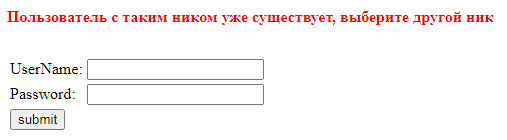

# Car Accident

##### Использованные технологии:

- ***Spring MVC***
- ***Spring Security***
- ***Spring Data***
- ***Hibernate***
- ***Apache Tomcat***
- ***Travis CI***
- ***Git***

## О проекте.

Проект представляет собой платформу для фиксирования нарушений ПДД. 
Доступна регистрация пользователя, добавление заявки, редактирование заявки.

- Общий вид главной страницы

- Страница добавления заявки

- Форма регистрации
